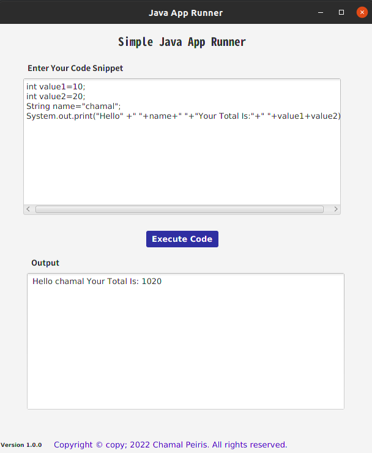
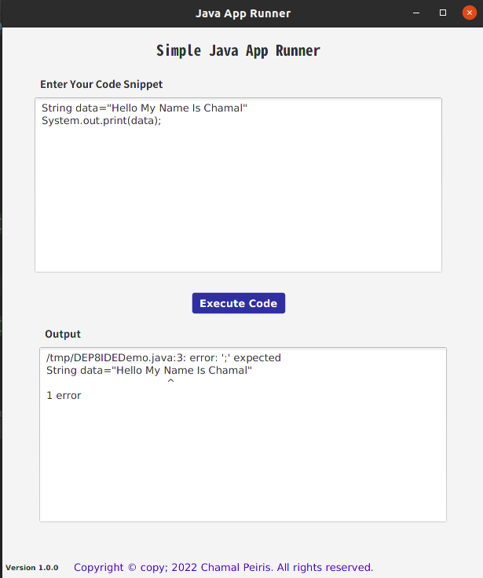
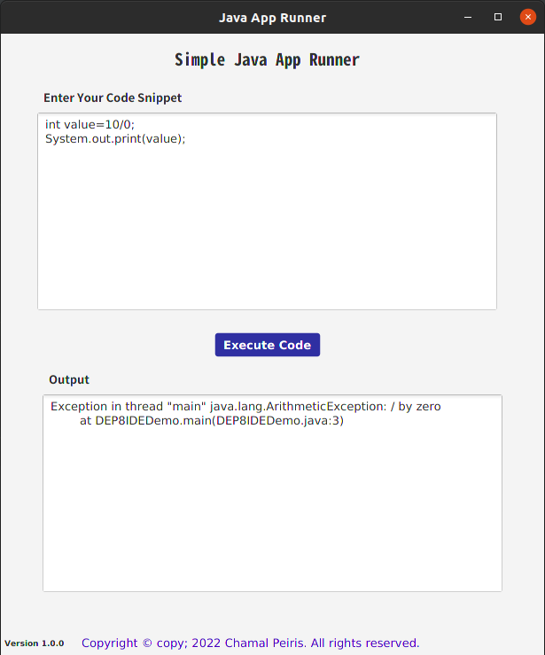

#Simple Java Application Runner

**This is a Javafx application which uses the java process class to carry out various process's. To be more specific, this application will use the process clas inorder to execute java code then compile, run and provide the necessary outputs. in addition the system will handle both compile time and runtime errors with the aid of getErrorStream() method**

### How to use this repo?

1. Clone the repository first  'git clone'

``https://github.com/Chamal-Peiris/simple-java-app-runner.git``

2. Once cloned, open the repository from any prefered IDE

3. Build and Run!

### Prerequisites
1.Use JDK 1.8

## Main User  Interface

## Compile Time Errors

## Run Time Errors

## Usage

* This Application Can Be Used to simply compile and run any java code.
* It will alert you with both compile and runtime errors.

### License

Version 1.0 , 25 February 2022

Copyright © copy; 2022 Chamal Peiris. All rights reserved.

Licensed under the [MIT](LICENSE) license

## Acknowledgements

* [Choose an Open Source License](https://choosealicense.com)
